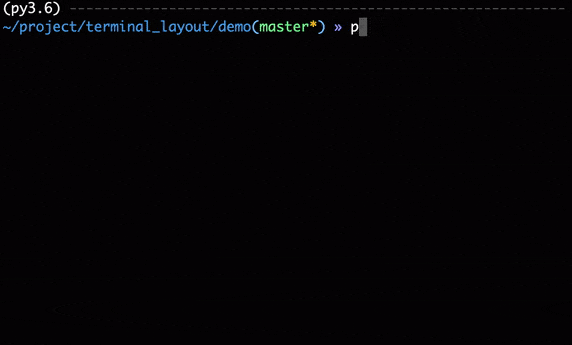
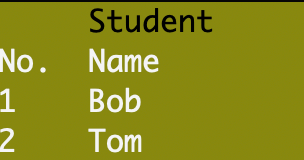
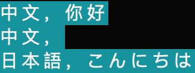

# terminal_layout

The project help you to quickly build layouts in terminal  
(这个一个命令行ui布局工具)




[](https://asciinema.org/a/226120)

# link

* [All Demo](https://github.com/gojuukaze/terminal_layout/tree/master/demo)

* [Doc](https://github.com/gojuukaze/terminal_layout)

* [https://asciinema.org/a/226120](https://asciinema.org/a/226120)

# install 
```bash
pip install terminal_layout
```

# Usage

 * easy demo:

```python
import time
from terminal_layout import *

ctl = LayoutCtl(TextView('id1', 'hello world!', width=20, fore=Fore.red, back=Back.green))

ctl.draw()

time.sleep(2)

view = ctl.find_view_by_id('id1')
view.text = 'hi world'
ctl.re_draw()


```


 * use table layout:

```python
from terminal_layout import *

ctl = LayoutCtl.quick(TableLayout,
                [
                    [TextView('title', 'Student', fore=Fore.black, back=Back.yellow, width=17,
                              gravity=Gravity.center)],

                    [TextView('', 'No.', width=5, back=Back.yellow),
                     TextView('', 'Name', width=12, back=Back.yellow)],

                    [TextView('st1_no', '1', width=5, back=Back.yellow),
                     TextView('st1_name', 'Bob', width=12, back=Back.yellow)],

                    [TextView('stw_no', '2', width=5, back=Back.yellow),
                     TextView('st1_name', 'Tom', width=12, back=Back.yellow)]
                ]
                
                )
                
ctl.draw()

```



 * use python2 unicode

```python
# -*- coding: utf-8 -*-
from terminal_layout import *
import sys
reload(sys)
sys.setdefaultencoding('utf-8')

ctl = LayoutCtl.quick(TableLayout,
                      [
                          [TextView('', u'中文，你好', back=Back.cyan, width=Width.wrap)],
                          [TextView('', u'中文，你好', back=Back.cyan, width=6)],
                          [TextView('', u'日本語，こんにちは', back=Back.cyan, width=Width.wrap)],
                      ]

                      )

ctl.draw()

```




## params

属性说明

 * fore & back
 
```python
TextView('','fore',fore=Fore.red)
TextView('','back',back=Back.red)
```


 * style

```python
TextView('','style',style=Style.dim)
```


 * width
 
```python
TextView('','width',width=10)
```


 * weight
 
```python
TextView('','weight',weight=1)
```


 * gravity
 
```python
TextView('','gravity',gravity=Gravity.left)
```


 * visibility
 
```python
TextView('','',visibility=Visibility.visible)
```


 * ex_style (not support windows)


```python
TextView('','ex_style',style=Style.ex_blink)
```


 * ex_fore & ex_back (not support windows)


```python
TextView('','ex_fore',fore=Fore.ex_red_1)
TextView('','ex_back',back=Back.ex_red_1)

```


# LICENSE

[GPLv3](https://github.com/gojuukaze/terminal_layout/blob/master/LICENSE)

# Thanks

 * [colorama](https://github.com/tartley/colorama) : Simple cross-platform colored terminal text in Python
 * [colored](https://gitlab.com/dslackw/colored) : Very simple Python library for color and formatting in terminal
